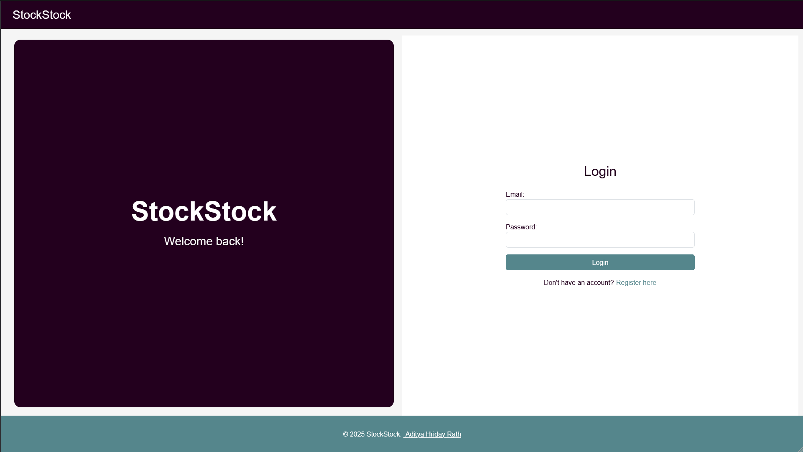
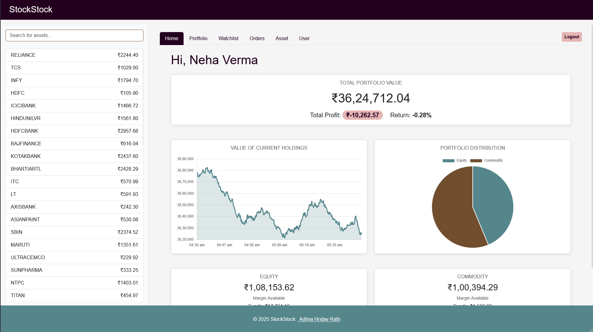
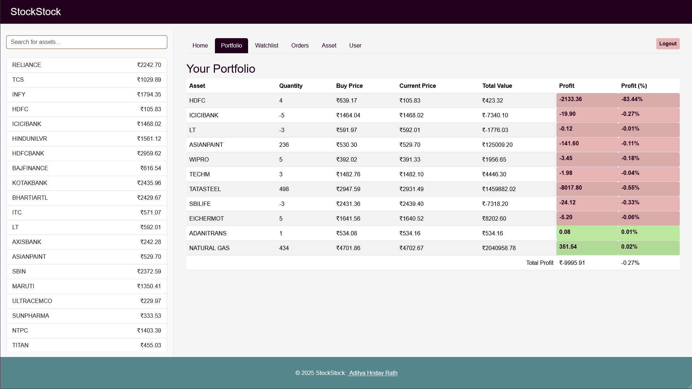
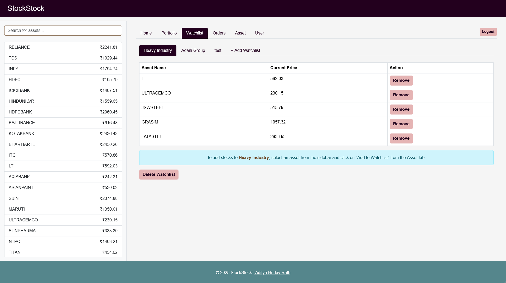
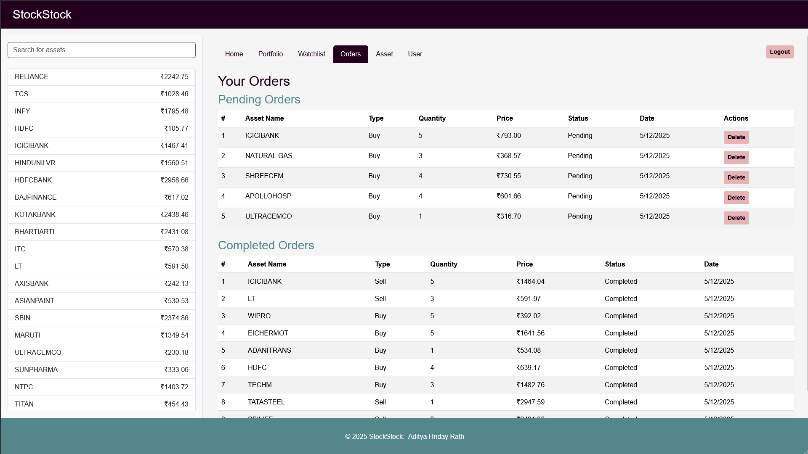
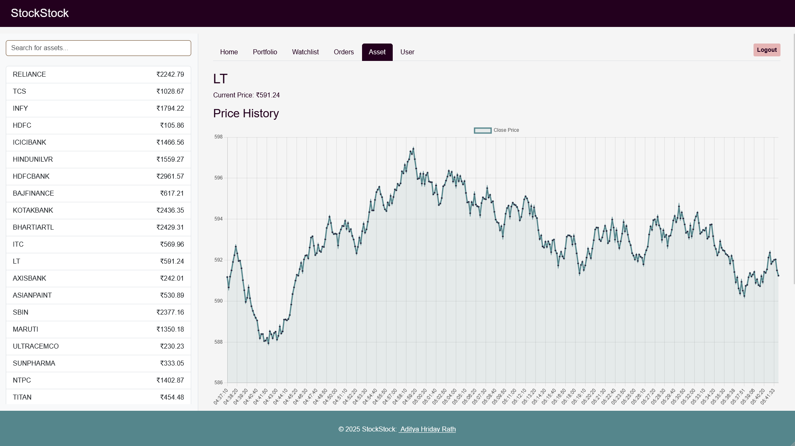
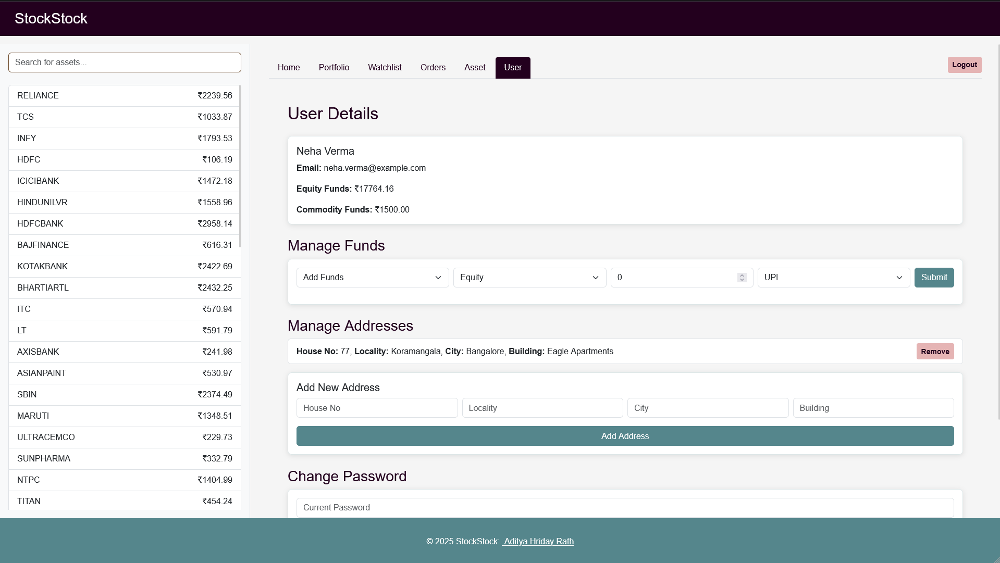

# StockStock - Financial Asset Management System

StockStock is a comprehensive full-stack web application designed for managing financial assets. It allows users to track real-time stock and commodity prices, manage a portfolio, execute buy/sell orders, and analyze their financial performance through interactive charts and detailed reports.

Link to video demo: https://youtu.be/_HeNL79Tzk0

The application is built using a modern tech stack:
- **Frontend:** React.js with Bootstrap for a responsive UI.
- **Backend:** Flask (Python) providing a RESTful API.
- **Database:** MySQL for robust data persistence.
- **Containerization:** Docker & Docker Compose for easy deployment.

---

## Application Overview & Features

### 1. Secure Authentication
**Screenshot:** `screenshots/Login.png`



*   **Split-Screen Interface:** A modern, visually appealing login and registration screen.
*   **User Registration:** New users can sign up with their personal details, address, and contact information.
*   **Secure Login:** Existing users can securely log in to access their personalized dashboard.

### 2. Dashboard (Home)
**Screenshot:** `screenshots/Home.png`



*   **Portfolio Summary:** At-a-glance view of Total Portfolio Value, Total Profit, and Return Percentage.
*   **Visual Analytics:**
    *   **Value of Current Holdings:** A line chart visualizing the historical performance of the user's current assets.
    *   **Portfolio Distribution:** A pie chart showing the allocation between Equity and Commodity assets.
*   **Margin Status:** Detailed cards showing Available Margin, Utilized Margin, and Total Funds for both Equity and Commodity segments.

### 3. Portfolio Management
**Screenshot:** `screenshots/Portfolio.png`



*   **Holdings Table:** A detailed list of all assets currently owned by the user.
*   **Real-Time Profit/Loss:** Dynamic calculation of profit/loss for each asset based on current market prices.
*   **Visual Indicators:** Color-coded badges make it easy to assess performance instantly.

### 4. Asset Watchlists
**Screenshot:** `screenshots/Watchlist.png`



*   **Custom Watchlists:** Users can create multiple named watchlists to track different groups of assets.
*   **Asset Management:** Easily remove assets from a watchlist or delete entire watchlists when they are no longer needed.
*   **Integration:** Assets can be added directly to a specific watchlist from the Asset Details page.

### 5. Order Management
**Screenshot:** `screenshots/Orders.png`



*   **Pending Orders:** View and manage orders that are waiting execution. Users can cancel (delete) pending orders to release locked funds.
*   **Completed Orders:** A historical record of all successfully executed trades.
*   **Order Details:** key information like Asset Name, Type (Buy/Sell), Quantity, Price, and Date/Time.

### 6. Asset Analysis & Trading
**Screenshot:** `screenshots/Asset.png`



*   **Price History Graph:** An interactive line chart showing the intraday price movement of the selected asset.
*   **Trading Interface:** A streamlined form to place Buy or Sell orders with automatic cost calculation and validation.
*   **Add to Watchlist:** specific assets can be quickly added to any of the user's created watchlists.

### 7. User Profile & Fund Management
**Screenshot:** `screenshots/User.png`



*   **Profile Management:** View account details and manage saved addresses.
*   **Fund Management:** Add or withdraw funds for Equity or Commodity trading using different payment modes (UPI, Card).
*   **Security:** Update account password securely.
*   **Session Control:** Secure Logout functionality.

---

## Technicals

### Data Initialization (on First Startup)
On the very first startup, the system automatically runs a series of scripts (`initialize.py` and its sub-scripts) to populate the database, providing a fully functional demo environment. This process includes:
*   **Users & Addresses**: 10 dummy users are created with unique details and linked addresses. Their default password is `password123`. For example, you can log in with `amit.sharma@example.com` and `password123`.
*   **Assets & Prices**: A comprehensive list of equity and commodity assets are generated, along with 1 hour of high-frequency historical price data for each.
*   **Portfolios**: Each user is assigned a diverse portfolio, ensuring they hold a mix of both equity and commodity assets.
*   **Orders & Transactions**: Random pending orders are generated, and a history of completed transactions is created, ensuring every user has some trading activity recorded.
*   **Watchlists**: Users are provided with pre-populated watchlists.

### Order Matching System
The application features a robust order matching engine, primarily managed by the `MatchOrders` MySQL stored procedure.

*   **Logic**: It continuously scans for `Pending` Buy and Sell orders for the same asset. A match occurs when a Buy order's price is greater than or equal to a Sell order's price (`Buy.price >= Sell.price`).
*   **Partial Orders**: The system efficiently handles partial order fulfillment. If a buy or sell order's quantity exceeds the available match, a transaction is recorded for the matched quantity, and the original pending order's quantity is updated to reflect the remaining balance.
*   **Price Execution**: Orders are typically executed at the seller's specified price (or the matching price).
*   **FIFO Prioritization**: Orders are processed on a First-In-First-Out (FIFO) basis, based on their date and time.
*   **Database Consistency**: Upon a successful match, the system ensures atomicity and consistency across the database:
    *   A record is created in the `Transaction` table.
    *   `Portfolio_Asset` holdings are updated for both buyer and seller.
    *   Triggers automatically adjust `User` equity and commodity funds based on the transaction value.

### Market Data Ticker
A dedicated `ticker` service runs continuously in the background to simulate real-time market data updates.

*   **Price Updates**: The `ticker.sh` script (often invoking `updateprices_catchup.py`) regularly updates the `Price` table for all listed assets. This ensures that the `AssetPriceView`, which provides the current market price, is always fresh.
*   **Data Stored**: The `Price` table captures high-frequency market data including `open_price`, `close_price`, `high`, `low`, `volume`, and the timestamp (`date`) for each asset. This data is crucial for historical analysis and portfolio valuation.

---

## Getting Started

### Prerequisites
*   Docker Desktop installed and running.

### Installation & Quickstart

1.  **Clone the repository:**
    ```bash
    git clone https://github.com/TheAditya700/stockapp
    cd stockapp
    ```

2.  **Start the application:**
    ```bash
    docker-compose up --build
    ```

3.  **Access the App:**
    *   Frontend: Open your web browser and navigate to `http://localhost:3000`.

4.  **Quick Login:**
    *   Use the following credentials to quickly log in and explore the application:
        *   **Email:** `amit.sharma@example.com`
        *   **Password:** `password123`

---

## Dummy User Accounts

For testing and demonstration purposes, the application comes initialized with 10 dummy user accounts. All accounts share the same default password.

**Default Password for all users:** `password123`

| Name             | Email                       |
| :--------------- | :-------------------------- |
| Amit Sharma      | `amit.sharma@example.com`   |
| Priya Patel      | `priya.patel@example.com`   |
| Priyansh Gupta   | `priyansh.gupta@example.com`|
| Anjali Nair      | `anjali.nair@example.com`   |
| Vikram Mehta     | `vikram.mehta@example.com`  |
| Deepika Rao      | `deepika.rao@example.com`   |
| Rohan Kallumal   | `rohan.k@example.com`       |
| Simran Singh     | `simran.singh@example.com`  |
| Karan Desai      | `karan.desai@example.com`   |
| Neha Verma       | `neha.verma@example.com`    |

## 🤖 AI Assistance & Acknowledgments

This project was developed with support from modern AI tools, which helped accelerate implementation and improve code quality.

- **ChatGPT (OpenAI GPT-4.1 / GPT-5.1)**  
  Assisted in backend architecture decisions, debugging Flask API routes, optimizing MySQL queries, designing the order-matching engine, and improving Docker & deployment workflows.

- **Google Gemini**  
  Helped refine frontend UI components, improve React code organization, draft documentation sections, and validate overall project structure.

All code was written, tested, and validated manually. AI tools were used only for guidance, debugging support, and productivity—not for generating full application components.
